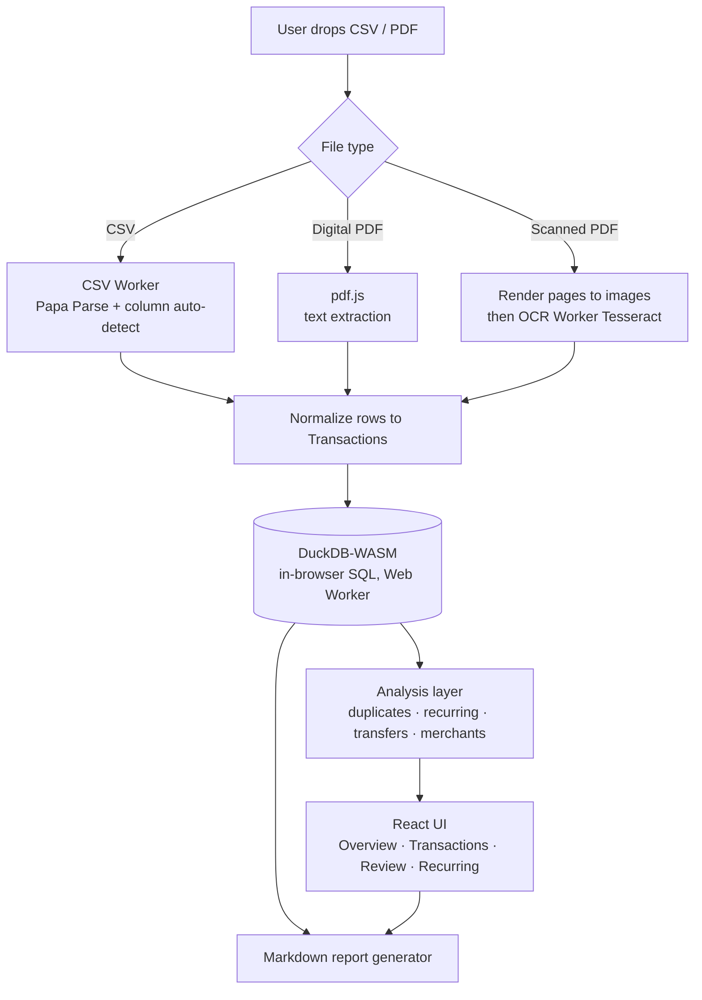

# Buidace Statement Analyzer

**Understand your bank statements — right in your browser, with nothing ever leaving your device.**

Upload a CSV or PDF bank statement and instantly see your income, spending, recurring bills, and duplicate charges. Then export a clean summary you can hand to a financial advisor or paste into an AI assistant.

**Live app:** [chike523.github.io/Buidace-Statement-Analyzer](https://chike523.github.io/Buidace-Statement-Analyzer/)

> [!NOTE]
> **100% private.** Your statements are read and analyzed entirely inside your browser tab. No file, no transaction, and no number is ever sent to a server. There is no backend.

---

## For everyone: what it does

Reading a bank statement line by line is slow and easy to get wrong. This tool does the tedious part for you:

- **Reads your statement** — works with CSV, Excel (`.xlsx`/`.xls`), OFX/QFX, normal (digital) PDFs, and even scanned/photographed PDFs (it reads the text from the image automatically).
- **Shows the big picture** — total money in, total money out, and what's left, with simple monthly charts.
- **Finds who you pay the most** — your biggest expenses and income sources, grouped so the same shop or person isn't split into ten different lines.
- **Spots recurring bills** — subscriptions and regular payments (weekly, monthly, or yearly) so nothing sneaks past you.
- **Catches double charges** — flags transactions that look like duplicates so your totals stay honest.
- **Notices money moving between your own accounts** — so a transfer isn't mistaken for real income or spending.
- **Handles several accounts at once** — import statements from different banks or wallets and see them together.
- **Gives you a shareable summary** — one click downloads a tidy report (or copies it) for an advisor or AI to review.

### How to use it

1. **Import** — drag a CSV or PDF onto the welcome screen.
2. **Check the columns** — for CSVs, the app guesses which column is the date, description, and amount; you confirm or fix it. Pick or create an account for the statement.
3. **Overview** — see your income, expenses, net flow, and monthly trend. Toggle options to hide internal transfers or group payees together.
4. **Transactions** — search, filter by date/amount/type, and scroll every line.
5. **Review** — resolve anything flagged as a duplicate and check detected transfers between your accounts.
6. **Export report** — the header button saves `financial-summary-YYYY-MM-DD.md` or copies it to your clipboard.

### Supported formats

| Format | Notes |
|--------|--------|
| **CSV** | Columns are auto-detected, with a manual mapping step to confirm |
| **Excel (.xlsx / .xls)** | First worksheet is read, header row auto-detected, then reuses the CSV mapping step |
| **OFX / QFX** | Structured banking format — transactions are read directly, no mapping needed |
| **Digital PDF** | Text is extracted directly from the PDF |
| **Scanned PDF** | Falls back to on-device OCR (image-to-text) when there's no text layer |

### Your privacy

Everything happens locally. The app has no server that receives your data, and the data lives only in the current browser tab — close the tab and it's gone. The report you export is generated on your machine; nothing is uploaded when you create or download it.

---

## For developers: how it's built

A **local-first, offline-capable** single-page app. There is deliberately no backend: parsing, storage, analysis, and reporting all run in the browser. The interesting engineering is in doing real analytical workloads (SQL aggregation, OCR, fuzzy matching) entirely client-side while keeping the UI responsive.

### Tech stack

| Area | Choice |
|------|--------|
| UI | **React 19** + **TypeScript**, built with **Vite 8** |
| Styling | **Tailwind CSS v4** (via `@tailwindcss/vite`) + small shadcn-style UI primitives |
| Analytics engine | **[DuckDB-WASM](https://duckdb.org/docs/api/wasm/overview)** — a full columnar OLAP SQL database running in a Web Worker |
| CSV parsing | **Papa Parse** (in a Web Worker) |
| Excel parsing | **SheetJS (`xlsx`)**, lazy-loaded and converted into the CSV pipeline |
| OFX / QFX | Custom tolerant SGML/XML parser (no dependency) |
| PDF text | **pdf.js** (`pdfjs-dist`, worker-based) |
| OCR | **Tesseract.js** (in a Web Worker, lazy-loaded) |
| Tables / charts | **@tanstack/react-table** + **@tanstack/react-virtual**, **Recharts** |
| Validation / dates | **Zod**, **date-fns** |
| Lint | **oxlint** |
| Hosting | **GitHub Pages** via GitHub Actions (static build) |

### Architecture at a glance



### How the pieces fit

**State & data flow.** A single React context (`src/context/AppContext.tsx`) owns app state and orchestrates the import → store → analyze → render loop. Data-fetching hooks (`useDashboardData`, `useTransactions`) subscribe to filters and re-query DuckDB, with cancellation guards and debouncing so rapid filter changes don't pile up work.

**In-browser SQL with DuckDB-WASM.** Instead of hand-rolling aggregations in JavaScript, transactions are loaded into an in-memory DuckDB instance (`src/db/duckdb.ts`) and all dashboard numbers — totals, monthly cash flow, top payees, per-account breakdowns — are computed with real SQL (`GROUP BY`, window functions, `strftime`). The schema (`accounts`, `transactions`, `duplicate_groups`, `duplicate_members`, `transfer_rejections`) lives only in the session; nothing is persisted to disk. Inserts are batched (500 rows/statement) to keep large imports fast.

**Everything heavy runs off the main thread.** CSV parsing, OCR, PDF.js, and DuckDB each run in **Web Workers**, so the UI never freezes during a big import. Expensive modules (Tesseract, pdf.js, the CSV/PDF parsers) are **lazily `import()`-ed** and code-split, so the initial bundle stays small and OCR is only downloaded if a scanned PDF actually needs it.

**Import pipeline.**
- *CSV:* headers are parsed and run through a heuristic column detector (`src/lib/column-detect.ts`) that suggests date/description/amount/balance mappings; the user confirms via a mapping UI before rows are normalized.
- *Digital PDF:* `pdf.js` extracts the text layer page by page (yielding to the event loop every few pages to stay responsive), then a text parser turns lines into rows.
- *Scanned PDF:* when little/no text is found (`has_text_layer` heuristic), pages are rasterized to images and passed to the Tesseract worker for OCR, with per-page progress reported back to the UI.
- *Excel:* the first worksheet is read with SheetJS, a heuristic finds the real header row (skipping bank title/metadata rows), and it's converted to CSV so it reuses the exact same column-mapping and conversion path as a `.csv` upload.
- *OFX / QFX:* a tolerant parser reads the `<STMTTRN>` blocks (`DTPOSTED`, `TRNAMT`, `NAME`/`MEMO`) directly into transactions — no column mapping needed — and picks up the account currency from `CURDEF`.

### Analysis algorithms

The analytical logic lives in pure, testable functions under `src/lib/`:

- **Duplicate detection** (`duplicates.ts`) — a two-pass approach: exact grouping on a fingerprint (normalized description + date + amount + account), then a fuzzy pass using **Levenshtein similarity** (≥ 0.85) across same-account/same-date/same-amount transactions to catch near-identical descriptions.
- **Recurring payments** (`recurring.ts`) — groups debits by normalized merchant (min. 3 occurrences), rejects noisy amounts (coefficient of variation > 0.15), infers a **weekly/monthly/yearly** cadence from the gaps between dates, and produces a confidence score plus a predicted next date.
- **Internal transfers** (`transfers.ts`) — pairs a debit with a matching credit (equal amount within tolerance, within 1 day), scoring cross-account, same-day, and keyword signals into `high`/`medium`/`low` confidence. Users can reject false positives, and detected transfers can be excluded from income/expense totals.
- **Merchant grouping** (`merchant.ts`) — a conservative "smart" mode that rolls up POS variants, bank fees, and P2P transfers using **structured rules only** (deliberately never fuzzy-matching people's names), alongside a plain "exact" mode.

### Report generation

`src/lib/report.ts` assembles a structured Markdown report — executive summary, per-account and monthly breakdowns, top payees/sources, recurring charges, transfers, largest transactions, data-quality notes, and prompts for an advisor or AI — all built from the same DuckDB queries and analysis functions used by the UI, then downloaded client-side.

### Project structure

```
src/
├── App.tsx                 # Shell, tabs, top-level layout
├── context/AppContext.tsx  # Central state + import/analyze orchestration
├── db/duckdb.ts            # DuckDB-WASM setup, schema, all SQL queries
├── workers/                # CSV, OCR (off-main-thread)
├── lib/
│   ├── parsers/            # csv, excel, ofx, pdf, statement-text, shared, pdf-render
│   ├── column-detect.ts    # CSV column auto-detection
│   ├── normalize.ts        # dates, amounts, fingerprints
│   ├── duplicates.ts       # exact + fuzzy duplicate detection
│   ├── recurring.ts        # recurring-payment detection
│   ├── transfers.ts        # internal-transfer matching
│   ├── merchant.ts         # merchant grouping rules
│   └── report.ts           # Markdown report builder
├── components/             # dashboard, table, upload, review, recurring, ui...
└── types/transaction.ts    # Shared domain types
```

---

## Running locally

```bash
git clone https://github.com/chike523/Buidace-Statement-Analyzer.git
cd Buidace-Statement-Analyzer
npm install
npm run dev
```

Open [http://localhost:5173](http://localhost:5173).

### Build & preview

```bash
npm run build     # tsc -b && vite build
npm run preview
```

> [!IMPORTANT]
> Use **npm 10** to install/regenerate the lockfile. CI (GitHub Actions, Node 22) ships npm 10, which resolves the nested optional `*-wasm32-wasi` dependencies differently from npm 11 — mixing versions makes `npm ci` fail. If you're on Node 24 (npm 11), run `npx npm@10 install` when touching dependencies.

## Deployment

The app is a fully static site deployed to **GitHub Pages** on every push to `main` via [`.github/workflows/deploy.yml`](.github/workflows/deploy.yml). The build injects `BASE_PATH=/<repo>/` so asset URLs resolve correctly under the project subpath (see `vite.config.ts`).

First-time setup: **Settings → Pages → Build and deployment → Source: GitHub Actions**.

## License

Private / all rights reserved unless otherwise specified by the repository owner.
